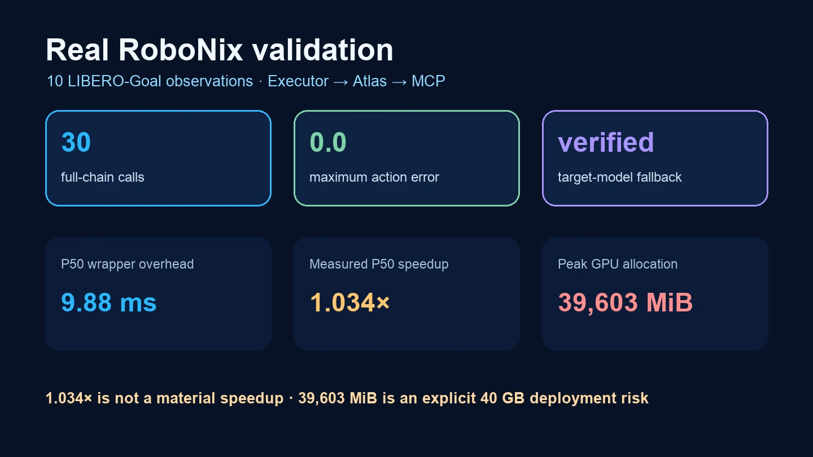
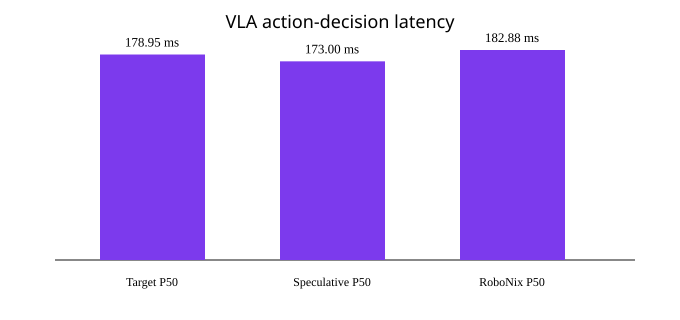

<!-- 居中块内有意全部使用 HTML：RoboNix 软件包目录使用 Python-Markdown，
     若在块级 HTML 中混写 Markdown，会把标题和徽章作为原始文本发布。 -->
<div align="center">
  <p><strong>本 RoboNix Service 由北京大学计算机学院陈翔老师课题组（<a href="https://if-lab-pku.github.io/">IFLab</a>）提供并维护。</strong></p>
  <h1>RoboNix VLA 动作决策 Service</h1>
  <p><strong>具备 GPU 延迟加载、目标模型校验和确定性回退的 VLA 推测推理能力。</strong></p>
  <p>
    <a href="README.md">English</a> ·
    <a href="https://github.com/lusunn111/service-vla-action-verify-rbnx/blob/main/README-CN.md#what-this-adds">带来了什么</a> ·
    <a href="https://github.com/lusunn111/service-vla-action-verify-rbnx/blob/main/README-CN.md#demo-video">演示视频</a> ·
    <a href="https://github.com/lusunn111/service-vla-action-verify-rbnx/blob/main/README-CN.md#release-results">发布结果</a> ·
    <a href="https://github.com/lusunn111/service-vla-action-verify-rbnx/blob/main/README-CN.md#quick-start">快速开始</a> ·
    <a href="https://github.com/lusunn111/service-vla-action-verify-rbnx/blob/main/README-CN.md#citation">引用</a>
  </p>
  <p>
    <a href="https://github.com/lusunn111/service-vla-action-verify-rbnx/actions/workflows/ci.yml"></a>
    <a href="LICENSE"></a>
    <a href="https://github.com/lusunn111/service-vla-action-verify-rbnx/stargazers"></a>
  </p>
  <p></p>
  <p><a href="https://github.com/lusunn111/service-vla-action-verify-rbnx/blob/main/README-CN.md#performance-snapshot"></a></p>
</div>

**RoboNix VLA 动作决策 Service** 面向现有 VLA（视觉语言动作模型），让
低成本候选动作经过目标模型与运动先验共同校验后再进入执行。系统通过自适应接受、
运动补偿和策略回退减少重复的大模型推理，同时保持任务级执行可靠性。当前已支持
OpenVLA，以及 Drafter 候选生成、并行验证、运动感知补偿和原策略回退。
在四类 LIBERO 套件上，完整项目最高达到 **1.57 倍**端到端加速和 **83.7%**
任务成功率，相对推测基线提升 **27%–37%**。

<a id="what-this-adds"></a>
## 🎯 这个 Service 给 RoboNix 带来了什么

本仓库把目标 OpenVLA 与 Drafter 推理链路整理到一个具备完整生命周期的 RoboNix
能力中。Service 负责模型加载、推测校验、目标模型恢复、输出校验和资源清理；任务
编排和物理动作执行仍位于能力提供方之外。

| RoboNix 获得的能力 | 具体行为 |
| --- | --- |
| 单一动作决策接口 | `verify` 接收指令和一张经过校验的本地观测图，返回一个候选动作及其推理模式。 |
| GPU 安全激活 | `rbnx boot` 不导入 PyTorch，也不分配模型显存；第一次真实调用才加载两个检查点。 |
| 确定性的恢复路径 | Drafter 或推测路径失败后调用已加载的目标模型；只有目标模型也失败才令能力调用失败。 |
| 仓库自包含的推理实现 | Wheel（Python 二进制分发包）包含 Service 推理源码，模型权重继续作为外部部署资产。 |
| 硬件安全边界 | Service 只返回候选动作，不发送机器人指令，也不负责执行闭环。 |
| 可复现的全链路证据 | 10 个真实 LIBERO-Goal 观测完成 30 次 Executor/MCP 调用，相对直接推测推理的最大动作误差为 `0.0`。 |

Catalog（软件包目录）标识为 `robonix.service.vla.action_verify`，公开契约为
`robonix/service/vla/action_verify/verify`。

<a id="demo-video"></a>
## 🎬 演示视频

<div align="center">
  <a href="docs/assets/readme/vla-validation-reel.mp4"></a>
  <p><sub>点击动图可播放 MP4。左侧是 1.00 倍原始动作序列，右侧把同一次真实成功回放直接加速到 1.57 倍。</sub></p>
</div>

视频记录 LIBERO-Goal 第 0 个任务、第 0 个初始状态：“打开柜子的中间抽屉”。Service
在 120 个策略步内完成任务，完整 RoboNix 链路耗时 42.64 秒。左右两侧都来自这一次
真实成功运行；右侧只按项目最高 1.57 倍加速比直接抽帧，因此更早到达同一个成功
终态。这是仿真演示，不是第二次计时基准，也不代表物理机器人实测。通过同一条
RoboNix 链路运行、录制并生成左右对比：

```bash
python -m pip install 'Pillow>=10' 'imageio>=2.34' 'imageio-ffmpeg>=0.5' 'numpy>=1.26'
python benchmarks/target_server/run_robonix_rollout.py \
  --atlas 127.0.0.1:50351 \
  --provider vla_action_verify \
  --output-dir "$RUN_ROOT" \
  --task-suite libero_goal --task-id 0 --initial-state 0 \
  --max-steps 300 --fps 30

python benchmarks/target_server/render_speed_comparison.py \
  --observations "$RUN_ROOT/observations" \
  --summary "$RUN_ROOT/summary.json" \
  --output "$RUN_ROOT/vla-speed-comparison.mp4" \
  --speedup 1.57 --fps 30
```

<a id="release-results"></a>
## ⚡ RoboNix 发布结果

0.1.0 发布候选版本通过真实的
`Executor → Atlas → MCP → Service → 仓库内推理源码 → 外部检查点` 路径完成验收，
没有用直接导入 Service 类代替 RoboNix 调用。

| 发布证据 | 实测值 | 结构化来源 |
| --- | ---: | --- |
| 真实输入 | 10 个 LIBERO-Goal 观测 | `benchmarks/target_server/input_manifest.json` |
| 全链路一致性 | 30 次调用，最大动作误差 0.0 | `benchmarks/target_server/results/summary.json` |
| Executor/MCP 延迟 | P50 182.88 ms，P95 212.10 ms | `benchmarks/target_server/results/calls.csv` |
| Service 包装开销 | P50 9.88 ms | `benchmarks/target_server/results/summary.json` |
| 目标模型回退 | 模型加载后注入真实 Drafter 故障并验证 | `benchmarks/target_server/results/fallback.json` |
| 延迟模型构建 | 12.64 秒，第一次完整调用 13.98 秒 | `benchmarks/target_server/results/model_load.json` |
| 实测 P50 加速比 | 1.034 倍，不构成显著加速 | `benchmarks/target_server/results/summary.json` |
| 进程峰值显存 | 39,603 MiB，是 40 GB 显卡上的明确部署风险 | `benchmarks/target_server/results/summary.json` |
| 真实仿真回放 | 120 个策略步成功完成任务 | `benchmarks/target_server/results/rollout-summary.json` |

<div align="center">
  
  <p><sub><strong>图 1.</strong> 真实发布验收结果。一致性与回退已经验证，但本次部署没有证明显著的推测加速。</sub></p>
</div>

### 按目标开始

| 目标 | 入口 | 所需资源 |
| --- | --- | --- |
| 检查软件包契约 | `python -m pytest -q && python scripts/release_audit.py` | 仅 CPU |
| 运行模拟 RoboNix 部署 | `examples/minimal-deployment/README.md` | 仅 CPU，不需要检查点 |
| 运行真实 Service | `examples/real-deployment/README.md` | RoboNix、CUDA、目标模型和 Drafter 检查点 |
| 通过 Executor/MCP 调用 | `benchmarks/target_server/invoke_executor.py` | 已启动部署与合法本地观测图 |
| 复现一致性与回退 | `benchmarks/target_server/run_benchmark.py` | 独立推理环境与空闲的 40 GB 级显卡 |
| 录制并对比真实回放 | `run_robonix_rollout.py` 与 `render_speed_comparison.py` | 已启动 Service、LIBERO、检查点与空闲的 40 GB 级显卡 |

## RoboNix Service 软件包

仓库根目录可以直接作为 `robonix.service.vla.action_verify` 发布，对外提供
`robonix/service/vla/action_verify/verify`。Service 只返回候选动作，不控制
机器人硬件。RoboNix 激活阶段不会导入 PyTorch 或占用 GPU，目标模型与 Drafter
在第一次真实请求时延迟加载。

仓库检查使用：

```bash
python -m pip install -e '.[dev]'
python -m pytest -q
python scripts/release_audit.py
python -m build
python scripts/verify_distribution.py
rbnx validate .
rbnx build -p .
```

真实推理应使用 Python 3.10 或 3.11，并在匹配 CUDA 的环境中安装
`.[inference]`。Wheel（Python 二进制分发包）已经包含 Service 适配器和
OpenVLA/SpecVLA 推理源码，模型检查点仍作为部署输入，不进入 Git。RoboNix
启动时可用 `ROBONIX_SERVICE_PYTHON` 指向该推理环境。公开接口与安全边界见
[CAPABILITY.md](CAPABILITY.md)，完整模拟与真实配置见
[examples/minimal-deployment/README.md](examples/minimal-deployment/README.md)，
准确的验证边界见 [VALIDATION.md](VALIDATION.md)。下文的完整研究实现和基准材料
继续保留。

<a id="real-robonix-deployment"></a>
## 真实 RoboNix 部署

正式发布的真实数据流为：

```text
Executor（执行器）-> Atlas（能力注册中心）-> MCP（模型上下文协议）
-> vla_action_verify -> 仓库自带 OpenVLA/SpecVLA 推理源码 -> 外部检查点
```

该能力只返回一个候选动作，绝不直接控制机器人硬件。已有检查点和观测数据应从
独立大容量数据根目录通过核对后的软链接接入，不能把权重复制进仓库。测试机的具体
目录策略和安全链接命令见
[benchmarks/target_server/README.md](benchmarks/target_server/README.md)。

```bash
python3.10 -m venv /path/to/environments/vla-service
source /path/to/environments/vla-service/bin/activate
python -m pip install --upgrade pip
python -m pip install -e '.[dev,inference]'

rbnx validate .
rbnx build -p .

cd examples/real-deployment
cp .env.example .env
# 在不跟踪的 .env 中填写检查点、输入目录、GPU、缓存、运行目录和 Python 路径。
set -a
source .env
set +a

rbnx build -f robonix_manifest.yaml
rbnx boot -v --no-update-check -f robonix_manifest.yaml
rbnx caps -v --server 127.0.0.1:50351
rbnx tools --server 127.0.0.1:50351
rbnx describe --server 127.0.0.1:50351 --provider vla_action_verify
rbnx inspect --server 127.0.0.1:50351
```

第一次调用前，Service 进程不应映射 PyTorch，也不应占用指定 GPU。真实调用必须
经过 Executor：

```bash
python ../../benchmarks/target_server/invoke_executor.py \
  --atlas 127.0.0.1:50351 \
  --provider vla_action_verify \
  --contract robonix/service/vla/action_verify/verify \
  --args-json '{"instruction":"pick up the bowl","observation_uri":"/absolute/input/observation.jpg","timeout_s":600}' \
  --timeout-s 900

rbnx shutdown -f robonix_manifest.yaml
```

第一次 `verify` 才导入推理依赖并加载两个模型。推测执行失败后会调用已加载的
目标模型，只有二者都失败才令 MCP 调用失败。观测图片必须位于
`allowed_image_root` 内，并通过签名、大小和像素数校验。全部配置字段和默认值
见 [config.spec](config.spec)。

<a id="performance-snapshot"></a>
## 📊 效果概览

项目在四类 LIBERO 套件上评测了运动感知校验与恢复。下表展示任务成功率（SR）
以及相对朴素推测 VLA 路径的端到端加速比。

| LIBERO 套件 | 成功率 | 加速比 |
| --- | ---: | ---: |
| Goal | 75.6% | 1.54× |
| Object | 72.3% | 1.49× |
| Spatial | **83.7%** | **1.57×** |
| Long | 48.8% | 1.48× |

## 📚 目录

- [这个 Service 给 RoboNix 带来了什么](#what-this-adds)
- [演示视频](#demo-video)
- [RoboNix 发布结果](#release-results)
- [真实 RoboNix 部署](#real-robonix-deployment)
- [📊 效果概览](#performance-snapshot)
- [📰 最新进展](#news)
- [⚡ 系统能力与效果](#system-results)
- [🧠 架构总览](#architecture)
- [🔌 RoboNix 集成与前景](#robonix-integration)
- [🧪 已验证版本](#validated-release)
- [⚙️ 环境要求](#requirements)
- [🚀 快速开始](#quick-start)
- [📦 检查点来源](#checkpoints)
- [🎬 LIBERO Rollout](#rollout)
- [🏋️ Drafter 训练](#training)
- [🩺 常见问题](#troubleshooting)
- [🗺️ 路线图](#roadmap)
- [📝 引用](#citation)
- [🤝 贡献者](#contributors)
- [📄 协议](#license)

<a id="news"></a>
## 📰 最新进展

- **2026-07-19**：🆕 发布系统级 VLA 动作决策 Service，补充能力效果、
  模型支持和中英文文档。
- **2026-07-18**：🔥 完成独立目录运行验证，成功加载目标模型与已有 Drafter，
  并导出 100 步 LIBERO H.264 rollout 视频。
- **2026-07-18**：🛠️ 开放 DeepSpeed 路径、任务选择和 rollout 步数上限配置。

<a id="system-results"></a>
## ⚡ 系统能力与效果

从 RoboNix 运行时视角看，该 Service 位于候选动作生成与机器人执行之间，负责校验
候选动作、补偿可恢复的运动误差，并在候选不可信时触发确定性的原策略回退。

| 系统级结果 | 当前能力 |
| --- | --- |
| 端到端加速 | 在已评测的 LIBERO 套件上达到 **1.45× 以上** |
| 相比固定阈值推测执行 | 获得 **25% 以上**的额外加速 |
| 执行可靠性 | 通过运动感知补偿和策略回退保持接近原策略的任务成功率 |
| 开源 rollout | OpenVLA + 已训练 Drafter，完成 100 步有界执行并导出 H.264 视频 |

### 支持模型

| 模型系列 | 状态 | 支持范围 |
| --- | --- | --- |
| OpenVLA | ✅ 已完成 | Drafter 训练、候选生成、校验、补偿、回退和 LIBERO rollout |
| 其他词元式 VLA | ⏳ 进行中 | 计划通过可插拔模型与 Drafter 接口接入 |

<a id="architecture"></a>
## 🧠 架构总览

<!--
IMAGEGEN ASSET
当前图片：docs/assets/speculative-decoding-overview-v2.png
重新生成提示词：docs/assets/IMAGEGEN_PROMPTS.md
原 SVG 继续作为可编辑备用文件保留。
-->

<div align="center">
  
  <p><b>图 2.</b> 离线 Drafter 准备，以及包含置信度、运动学接受和目标策略回退的在线推测执行链路。</p>
</div>

推测解码的系统收益不只取决于模型前向时间，还取决于候选接受率、候选树形状、
图像预处理、仿真执行、日志和回退开销。因此正式实验必须在相同硬件、模型和随机
种子下与自回归基线进行端到端比较。

<a id="robonix-integration"></a>
## 🔌 RoboNix 集成与前景

该 Service 是一个可独立部署的 RoboNix 能力提供方，通过稳定的能力契约接入系统。基于物理先验的验证与回退逻辑保留在能力提供方内部，Atlas 负责能力发现，Nexus 负责请求传输，Executor 负责能力调度，不需要修改 RoboNix 核心运行时。

<div align="center">
  
  <p><b>图 3.</b> 可复用记忆服务、自定义服务与基于 VLA 的用户技能在 RoboNix 中的系统级接入位置。</p>
</div>

未来可以在统一接口下继续扩展不同 Drafter、物理约束、验证策略和在线数据回流机制，使具身执行算法能够独立于机器人硬件和 RoboNix 核心持续演进。

<a id="validated-release"></a>
## 🧪 已验证版本

0.1.0 发布候选版本已于 2026-08-01 使用 RoboNix 提交
`48af09190b99f7847dddf68457eec2db42d2c1a7`、A100 40GB GPU、外部 OpenVLA
LIBERO-Goal 检查点、兼容 Drafter 和 10 个真实 LIBERO-Goal 观测完成验收。

| 路径 | 调用数 | 平均延迟 | P50 | P95 |
| --- | ---: | ---: | ---: | ---: |
| 直接目标模型 | 30 | 179.31 ms | 178.95 ms | 181.03 ms |
| 直接推测执行 | 30 | 176.12 ms | 173.00 ms | 202.72 ms |
| Executor -> Atlas -> MCP | 30 | 187.45 ms | 182.88 ms | 212.10 ms |

30 次直接推测执行和 30 次 RoboNix 全链路动作完全一致，最大误差为 `0.0`。
Drafter 真实故障注入成功进入目标模型回退；关闭后 GPU 1 从模型占用恢复到
3 MiB 空闲基线。模型构建耗时 12.64 秒，第一次完整 Service 调用耗时 13.98 秒，
P50 包装开销为 9.88 ms。

本次目标模型相对推测执行的 P50 加速比只有 1.034 倍，因此不能宣称显著性能收益。
由于保留的 TensorFlow 图像预处理栈会预留大部分剩余显存，进程级峰值达到
39,603 MiB；这对 40GB GPU 是必须明确披露的部署风险。



原始调用、回退证据、精确环境与报告边界见
[benchmarks/target_server/](benchmarks/target_server/) 和
[VALIDATION.md](VALIDATION.md)。

此外，仓库保留了此前研究链路完成的 100 步 LIBERO 有界冒烟测试。它证明仿真
接入和视频导出，不证明任务成功：


*100 步验证 rollout 的首帧、中间帧和末帧。*

<a id="quick-start"></a>
## 🚀 快速开始

仓库不包含模型、数据集或输出。建议把大文件放到独立数据盘，再通过绝对路径引用。

```bash
conda create -n robonix-spec python=3.10 -y
conda activate robonix-spec
python -m pip install --upgrade pip
python -m pip install -r requirements.txt
python -m pip install -e . --no-deps

python -m pytest -q tests
python -m scripts.run --help
```

<a id="requirements"></a>
## ⚙️ 环境要求

| 组件 | 要求 |
| --- | --- |
| 操作系统 | 推荐 Linux，DeepSpeed 与无头 LIBERO/MuJoCo 评测依赖 Linux 环境 |
| Python | 软件包检查支持 3.10 以上；固定版本真实推理使用 3.10 或 3.11 |
| PyTorch | 2.2.0 |
| CUDA | 已验证环境为 CUDA 12.1，需与 PyTorch 和驱动版本匹配 |
| 仿真环境 | LIBERO 0.1.0、MuJoCo 与 EGL |
| 训练环境 | DeepSpeed 0.16.6，推荐多 GPU |

根目录 `requirements.txt` 是统一依赖入口，实际固定版本位于
`requirements/requirements-min.txt`。仓库不包含模型、数据集或运行输出。

<a id="checkpoints"></a>
## 📦 检查点从哪里来

| 资产 | 来源 |
| --- | --- |
| 目标 VLA | OpenVLA 官方仓库或 Hugging Face 上的 LIBERO 微调检查点 |
| Drafter | 使用本仓库的数据生成与 DeepSpeed 训练流程产生，或复用结构兼容的已有检查点 |
| LIBERO | 官方 LIBERO 源码、任务定义、初始状态和 MuJoCo/EGL 环境 |

目标 VLA 与 Drafter 必须在模型结构、词表、隐藏维度和动作编码上兼容。不要把任意
小模型检查点直接当作 Drafter 使用。

<a id="rollout"></a>
## 🎬 LIBERO Rollout

```bash
export PYTHONPATH="$PWD/vendor/openvla:/path/to/LIBERO:${PYTHONPATH:-}"
export CUDA_VISIBLE_DEVICES=0
export MUJOCO_GL=egl
export MUJOCO_EGL_DEVICE_ID=0

python -m scripts.run \
  experiments/robot/libero/run_libero_goal_Spec.py \
  --model_family openvla \
  --pretrained_checkpoint /data/checkpoints/openvla_goal \
  --spec_checkpoint /data/checkpoints/drafter_goal \
  --task_suite_name libero_goal \
  --task_ids 0 \
  --num_trials_per_task 1 \
  --max_steps_override 100 \
  --local_log_dir /data/outputs/speculative \
  --center_crop True \
  --use_wandb False
```

视频默认写入 `./rollouts/<日期>/`，日志写入 `--local_log_dir`。确认单任务、
单回合能够运行后，再移除任务和步数限制执行完整评测。

<a id="training"></a>
## 🏋️ Drafter 训练

先使用 `specdecoding/train-scripts/ge_data_all_openvla_token_only_libero_goal.py`
生成训练样本，再运行：

```bash
cd vendor/openvla/specdecoding/train-scripts

OPENVLA_CHECKPOINT=/data/checkpoints/openvla_goal \
DRAFTER_TRAIN_DATA=/data/drafter-training-data \
DRAFTER_OUTPUT_DIR=/data/checkpoints/drafter_goal \
GPU_IDS=0,1 \
WANDB_MODE=offline \
bash train_ds_libero_goal.sh
```

部署验收不需要跑完训练，可以直接加载已经训练好的兼容 Drafter 完成 rollout。

## 🗂️ 目录结构

```text
.
├── modules/                  # Drafter、候选、验证、接受和策略目录
├── scripts/                  # 稳定脚本入口
├── benchmarks/libero/        # LIBERO 评测与速度测试
├── configs/                  # DeepSpeed 与模型配置
├── requirements.txt          # 统一安装入口
├── requirements/             # 依赖固定版本
├── tests/                    # 结构与独立入口测试
├── vendor/openvla/           # 推测执行与 OpenVLA 兼容实现
├── docs/assets/              # 架构图和 rollout 预览
└── service_bootstrap.py      # 原始代码激活与安全脚本分发
```

`vendor/openvla/` 是项目算法行为的权威实现，`modules/` 与 `scripts/` 提供便于服务化
和后续接入 RoboNix 的工程视图。

<a id="troubleshooting"></a>
## 🩺 常见问题

### `rbnx boot` 后没有显存占用

这是预期生命周期。激活阶段只注册能力，不导入 PyTorch；目标模型与 Drafter 在
第一次 `verify` 时加载。第一次模型调用前应先用 `rbnx caps`、`rbnx tools` 和
`rbnx describe` 检查能力注册。

### 第一次请求明显慢于后续请求

第一次请求包含推理依赖导入、检查点构建和显存分配。冷启动必须与稳定阶段延迟
分别统计，不能在不说明的情况下把第一次调用混入热调用 P50/P95。

### 40 GB 显卡出现显存不足

需要同时检查模型真实分配和框架级预留。已验证环境中的 TensorFlow 预处理会预留
大部分剩余显存，使进程级占用达到 39,603 MiB。应使用独立 GPU，避免与其他模型
共置，并在停止进程前先核对进程所有者。

### Drafter 推理失败

Service 应复用已加载的目标模型，返回 `mode=target_fallback` 和
`fallback_used=true`。如果整个 MCP 调用失败，需要继续检查目标模型路径是否也
失败。故障注入只能放在基准框架中，生产接口不暴露测试开关。

### 观测图在模型加载前被拒绝

解析路径并确认它仍位于 `allowed_image_root` 下。图片必须通过文件签名、字节大小
和像素数量校验。0.1.0 不接受网络 URL；应在 Service 外部完成下载和校验，再把
图片放入配置的输入目录。

### 直接推理与 MCP 动作不同

需要固定相同检查点、Drafter 状态、预处理配置、指令、图像字节和随机状态，并在
仿真执行前直接比较 7 维动作。如果推测路径此前失败过，测试目标模型回退前必须
清除候选树状态。

### 验收结束后如何清理

执行 `rbnx shutdown -f robonix_manifest.yaml`，确认 Service 进程退出，再检查选定
GPU。只能停止本次部署启动的进程，共享 GPU 或运行时可能承载其他实验。

<a id="roadmap"></a>
## 🗺️ 路线图

- [x] 发布可独立运行的纯源码仓库。
- [x] 验证目标模型、Drafter 加载和有界视频 rollout。
- [x] 将运动感知校验、补偿和策略回退整理为统一执行链路。
- [x] 采用与 RoboNix 一致的木兰宽松许可证并补全正式引用。
- [ ] 发布带校验值和模型卡的兼容 Drafter 检查点。
- [ ] 补充自回归与推测解码的端到端基准和接受率指标。
- [ ] 接入更多 Drafter 结构与验证策略。
- [ ] 通过统一 Service 契约验证更多 VLA 模型系列。
- [x] 提供带版本号的 RoboNix Service 适配器和能力契约。

<a id="citation"></a>
## 📝 引用

如果该 Service 对你的研究有帮助，欢迎给仓库一个 Star ⭐，并引用本软件仓库：

```bibtex
@software{mao2026robonix_vla_action_verify_service,
  author  = {Mao, Zhihao and He, Huiru and Zheng, Zihao},
  title   = {RoboNix VLA Action Verify Service},
  year    = {2026},
  version = {0.1.0},
  url     = {https://github.com/lusunn111/service-vla-action-verify-rbnx}
}
```

<a id="contributors"></a>
## 🤝 贡献者

感谢 [HuiruHe](https://github.com/HuiruHe) 和
[zhengzihaoPKU](https://github.com/zhengzihaoPKU) 对该 Service 的贡献。贡献者记录
规则见 [CONTRIBUTORS.md](CONTRIBUTORS.md)。

<a id="license"></a>
## 📄 协议

本项目采用木兰宽松许可证第 2 版(Mulan PSL v2)，详见 [LICENSE](LICENSE)；
第三方代码继续遵循各自目录中的原始协议。
